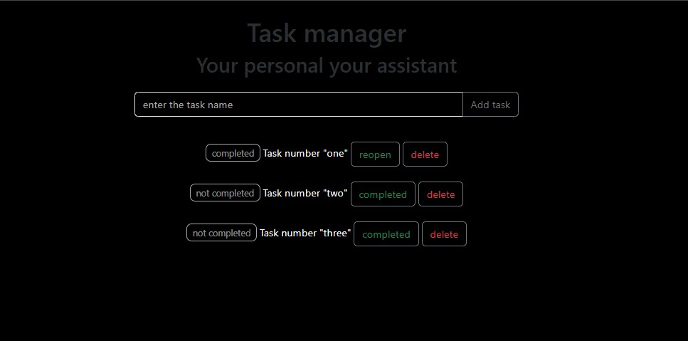

📑# Django Tasks App





A simple task management application built with Django that allows users to create, track,
and manage their daily tasks and exercises.

## Features

- ✅ Create new tasks/exercises
- ✅ Mark tasks as complete/incomplete
- ✅ View all tasks with their status
- ✅ Simple and clean interface

## Models

### Tasks Model
- `title` - CharField for task/exercise name (max 100 characters)
- `is_complete` - BooleanField to track completion status (default: False)

## Installation

1. Clone the repository:
```bash
git clone https://github.com/yourusername/django-tasks.git
cd django-tasks
```

2. Create a virtual environment:
```bash
python -m venv venv
source venv/bin/activate  # On Windows: venv\Scripts\activate
```

3. Install dependencies:
```bash
pip install django
```

4. Run migrations:
```bash
python manage.py makemigrations
python manage.py migrate
```

5. Create a superuser (optional):
```bash
python manage.py createsuperuser
```

6. Run the development server:
```bash
python manage.py runserver
```

## Usage

1. Access the application at `http://127.0.0.1:8000/`
2. Add new tasks using the interface
3. Mark tasks as complete when finished
4. View and manage all your tasks

## Admin Interface

Access the Django admin at `http://127.0.0.1:8000/admin/` to manage tasks through the admin panel.

## Project Structure

```
django-tasks/
├── models.py          # Task model definition
├── views.py           # View logic
├── urls.py            # URL routing
├── templates/         # HTML templates
├── static/            # CSS, JS, images
└── migrations/        # Database migrations
```

## Contributing

1. Fork the repository
2. Create a feature branch (`git checkout -b feature/amazing-feature`)
3. Commit your changes (`git commit -m 'Add amazing feature'`)
4. Push to the branch (`git push origin feature/amazing-feature`)
5. Open a Pull Request

## License

This project is licensed under the MIT License.

## Requirements

- Python 3.8+
- Django 4.0+